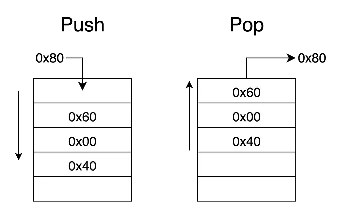
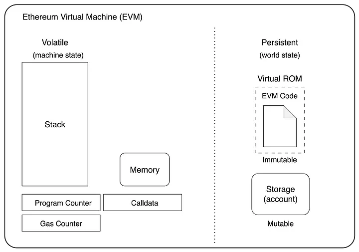
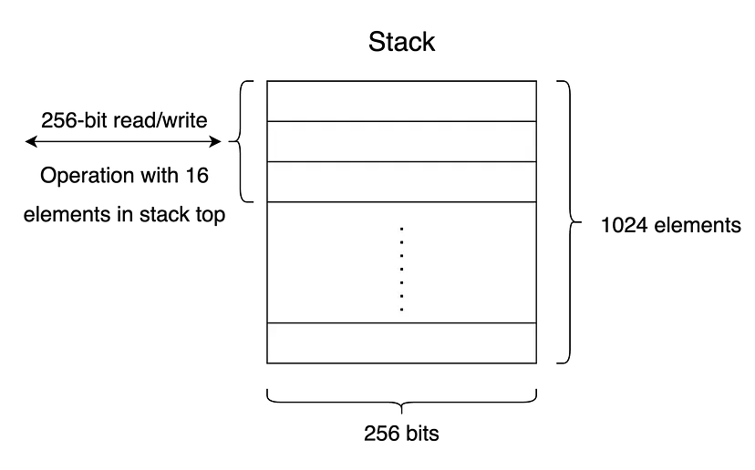
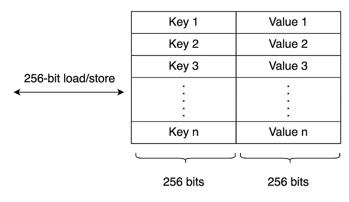
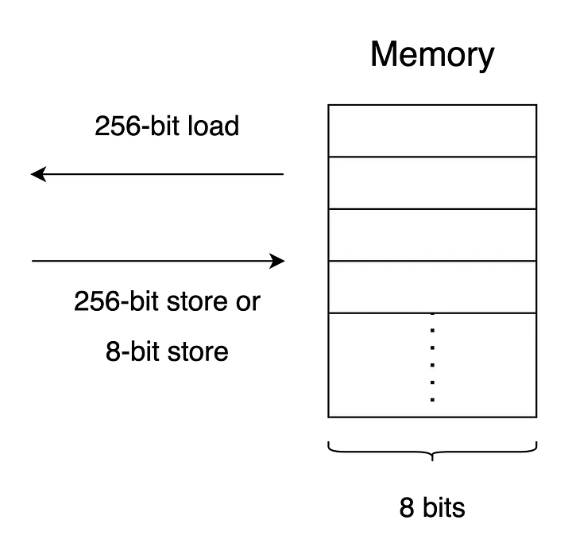
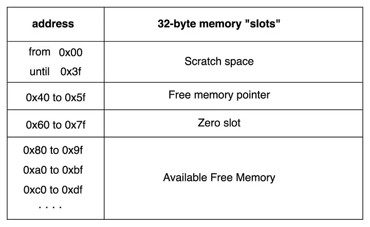

{:toc}

# EVM

The Ethereum Virtual Machine (EVM) is the core component of the Ethereum network. The EVM is a piece of software that allows the deployment and execution of smart contracts written in a high level language such as Solidity. After writing the contract, it is compiled into bytecode and deployed to the EVM. The EVM runs on each node in the Ethereum network.

Solidity Assembly refers to a low-level programming language that allows developers to write code at a level closer to the EVM itself. It provides a more granular control over the execution of smart contracts, allowing for optimizations and customization that may not be achievable through higher-level Solidity code alone.

The language used for inline assembly in Solidity is known as Yul. This programming language acts as an intermediary that compiles to EVM bytecode. It is designed to be a low-level language that gives developers more fine-grained control over the execution of their smart contracts. It can be used in stand-alone mode and for inline assembly inside Solidity. Yul is designed to be a low-level stack-based language, providing developers with the ability to write more optimized and efficient code. Before we explain Solidity assembly we need to understand how the components of the EVM work.

The EVM is a quasi-Turing-complete state machine. In this scenario, the term "quasi" means that the execution of a process is limited to a finite number of computational steps by the amount of gas available for any given smart contract execution. This is how Ethereum deals with the halting problem and the situation where execution might (maliciously or accidentally) run forever. Then, the scenario where the Ethereum platform halts in its entirety is avoided.

Gas is a concept that measures the computational effort needed to complete a transaction in Ethereum. The cost of a transaction is paid in Ether and is related to the Gas and Gas price. Our goal during this journey is to learn how to minimize the total amount of gas consumed without compromising security.

## Code Optimization Problem
Inline assembly is a way to access the EVM at a lower level. It bypasses several important safety features and checks of Solidity. The correct use of inline assembly can significantly reduce the execution cost. However, you should only use it for tasks that need it, and only if you know what you are doing. Optimizing the code using inline assembly might introduce new security issues to your code. To master inline assembly we need to understand how the EVM and its components work.

In the EVM, you have to pay every time you access any storage variable for the first time, this is called "cold" access and it costs 2100 gas. The second or consecutive time is known as “warm” access and it costs 100 gas.

The following code is an example of how we can optimize our code with Yul. The function `SetData1` sets a new value to the global variable value using Solidity in a conventional way. The first time we assign this new value it costs 22514 gas. The second one will cost much less, i.e., 5414 gas.

```solidity
uint256 public value;

function setData1(uint256 _newValue) public {
    value = _newValue;
}
```

Function `setData2` implements inline Assembly. An inline assembly block is marked by assembly { … }, where the code inside the curly braces is code in the Yul language. At this point it is not necessary to understand the source code, just keep in mind that this piece of software is accessing the Storage space at a lower level. As a consequence, the execution will be cheaper.

In our example, the first time we modify the value it will cost 22484 gas. In consecutive times, the cost will be 5384 gas. The difference might not seem significant, however we should consider that this piece of code might be executed thousands of times.

```solidity
function setData2(uint256 _newValue) public {
    assembly {
        sstore(0, _newValue)
    }
}
```

Why is storage so expensive? Remember that we are in a decentralized world and the data is not stored in just one place but on tens of thousands of nodes. It also has to be readily available to every single node in the network if a future transaction comes along to access or change it. The overall cost of this data is equal to the sum of the storage space it consumes and the computational effort to generate it across the whole network.

---

# EVM Stack, Storage and Memory
The EVM is a stack-based machine that operates on a data structure called a stack, which holds values and executes actions. The EVM has its own set of instructions known as opcodes that it uses to execute tasks such as reading and writing to storage, calling other contracts, and performing mathematical operations. The stack operates on a last-in, first-out (LIFO) basis, see figure 1, which means that the most recently inserted item is stored at the top of the stack and is the first item to be removed.



When a smart contract is executed, the EVM creates an execution context that includes various data structures and state variables. After execution has finished, the execution context is discarded, ready for the next contract. During execution, the EVM maintains a temporary memory which does not persist between transactions. The EVM executes a stack machine with a depth of 1024 items. Each item is a 256-bit word, this size was chosen for the ease of use with 256-bit hashing and elliptic curve cryptography.

The EVM has the following components:

- **Stack**: The EVM’s stack is a data structure that operates on a Last-Input, First-Output (LIFO) basis for storing temporary values during the execution of a smart contract.
- **Storage**: A permanent storage that is part of the Ethereum state, initialized to zero only the first time.
- **Memory**: A volatile, dynamically sized byte array used for storing intermediate data during the execution of a contract. Memory is initialized to zero every time a new execution context is created.
- **Calldata**: This is also a volatile data store region, similar to memory. However it stores immutable data. It is intended to hold data sent as part of a smart contract transaction.
- **Program Counter**: The program counter (PC) points to the next instruction to be executed by the EVM. The PC usually increases by one byte after an instruction is executed.
- **Virtual ROM**: The smart contract is stored in this region as bytecode. Virtual ROM is read-only.



## EVM Stack
The program’s instructions and data are kept in memory in this architecture, and the program’s execution is controlled by a *stack pointer* that points to the top of the stack. The stack pointer keeps track of where the next value or instruction will be saved or retrieved on the stack. When a program runs, it adds values to the stack and performs operations on the values that are already there. When a code wants to add two numbers, it pushes the numbers onto the stack and then performs the addition operation on the top two values. The result is then returned to the stack.



One of the most important characteristics of a stack-based architecture is that it allows for highly simple and efficient operation execution. Because the stack is a LIFO data structure, it enables for easy and quick data and instruction handling.

The EVM has its own set of instructions known as opcodes. Opcodes are used to execute tasks such as reading and writing to storage, calling other contracts, and performing mathematical operations. The EVM instruction set offers most of the operations you might expect, including:

- Stack Manipulating: POP, PUSH, DUP, SWAP
- Arithmetics/comparison/bitwise: ADD, SUB, GT, LT, AND, OR
- Environmental: CALLER, CALLVALUE, NUMBER
- Memory-manipulation: MLOAD, MSTORE, MSTORE8, MSIZE
- Storage-manipulation: SLOAD, SSTORE
- Program counter related opcodes: JUMP, JUMPI, PC, JUMPDEST
- Halting opcodes: STOP, RETURN, REVERT, INVALID, SELFDESTRUCT

## EVM Storage
The EVM Storage is a non-volatile space and holds key-value pairs of 256 bits –> 256 bits. The total number of storage slots in a contract is $$2^{256}$$ which is a very huge number of slots. Each smart contract on the blockchain has its own storage space.

During function calls storage is used for data that needs to be remembered between function calls. It is used to store variables and data structures that need to be available even after the smart contract execution has ended.



The opcodes for accessing storage are: SLOAD and SSTORE

The account’s storage is a permanent data store, only used by smart contracts. An External Owned Account (EOA) will always have no code and an empty storage.

## EVM Memory
Memory is the volatile memory in the architecture whose data is not persistent across the blockchain. Memory is a random-access data structure that stores temporary data during the execution of a smart contract.



Memory is divided in four sections: 2 slots for the scratch space, one slot for the free memory pointer, the zero slot and one slot that points to the available free memory. The first 64 bytes of space will be used by hashing methods which need a temporary space to store intermediate outputs before ultimately returning a final output.

The free memory pointer is simply a pointer to the location where free memory starts. It ensures smart contracts keep track of which memory locations have been written to and which are still available. This protects against a contract overwriting some memory that has been allocated to another variable.



Memory is used to store variables and data structures that are not needed to be kept in storage. The memory can be resized during the execution of a smart contract, but it is slower and more expensive to access than the stack.

Consider that memory is zero initialized and the opcodes that are used for accessing the memory are: MLOAD, MSTORE, MSTORE8

> Source: [Medium](https://coinsbench.com/ethereum-virtual-machine-evm-deep-dive-part-i-7dd6fe7b2f44).