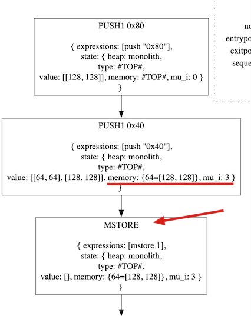

# Opcodes
Di seguito tutti gli opcodes implementati.

## MLOAD
```java
ArrayDeque<Interval> result = stack.clone();
Interval new_mu_i = null; 

Interval offset = result.pop();

if(mu_i.compareTo(new Interval(1,1)) == -1) {
	// This is an error. We cannot read from memory if there is no active words saved
	// TODO to handle this error
}

if(offset.interval.isSingleton()) {
	BigDecimal offsetBigDecimal = offset.interval.getHigh().getNumber();
	BigDecimal thirtyTwo = new BigDecimal(32);
	BigDecimal current_mu_i = offsetBigDecimal.add(thirtyTwo)
										  .divide(thirtyTwo)
										  .setScale(0, RoundingMode.UP); 
										  // setScale() = Ceiling function 
	
	Interval state = memory.getState(offsetBigDecimal);
	
	result.push(state);
	
	// We create a new Interval singleton with the newly calculated `current_mu_i`
	Interval intervalCurrent_mu_i = new Interval(current_mu_i.intValueExact(),
												 current_mu_i.intValueExact());
												 
	// Then we compare the 2 mu_i and update the new value
	if(mu_i.compareTo(intervalCurrent_mu_i) == -1)
		new_mu_i = intervalCurrent_mu_i;
	else 
		new_mu_i = mu_i;

} else {
	// TODO to handle else-condition
	result.push(Interval.TOP);
}

return new SymbolicStack(result, memory, new_mu_i);
```

> Un intervallo viene considerato Singleton se il limite inferiore e il limite superiore coincidono.

---

## MSTORE
```java
ArrayDeque<Interval> stackResult = stack.clone();
Memory memoryResult = null;
Interval new_mu_i = null; 

Interval offset = stackResult.pop();
Interval value = stackResult.pop();

if(offset.interval.isSingleton()) {
	BigDecimal offsetBigDecimal = offset.interval.getHigh().getNumber();
	BigDecimal thirtyTwo = new BigDecimal(32);
	BigDecimal current_mu_i = offsetBigDecimal.add(thirtyTwo)
											  .divide(thirtyTwo)
											  .setScale(0, RoundingMode.UP); 
											  // setScale() = Ceiling function 
	
	memoryResult = memory.putState(offsetBigDecimal, value);
	
	// We create a new Interval singleton with the newly calculated `current_mu_i`
	Interval intervalCurrent_mu_i = new Interval(current_mu_i.intValueExact(), 
												 current_mu_i.intValueExact());

	// Then we compare the 2 mu_i and update the new value
	if(mu_i.compareTo(intervalCurrent_mu_i) == -1)
		new_mu_i = intervalCurrent_mu_i;
	else 
		new_mu_i = mu_i;
		
} else {
	// TODO to handle else-condition
}

return new SymbolicStack(stackResult, memoryResult, new_mu_i);
```

Dobbiamo ritornare una nuova `memoryResult` e una nuova `new_mu_i` per evitare problemi di incoerenza (nel CFG viene visualizzata la memoria modificata prima di essere effettivamente modificata).



---

## MSTORE8
```java
ArrayDeque<Interval> result = stack.clone();
Memory memoryResult = null;
Interval new_mu_i = null; 

Interval offset = result.pop();
Interval value = result.pop();

if(offset.interval.isSingleton()) {
	BigDecimal one = new BigDecimal(1);
	BigDecimal thirtyTwo = new BigDecimal(32);
	
	BigDecimal offsetBigDecimal = offset.interval.getHigh().getNumber();
	BigDecimal current_mu_i = offsetBigDecimal.add(one)
											  .divide(thirtyTwo)
											  .setScale(0, RoundingMode.UP); 
											  // setScale() = Ceiling function 
	
	if(value.interval.isSingleton()) {
		BigDecimal valueBigDecimal = offset.interval.getHigh().getNumber();
		BigDecimal valueByteBigDecimal = valueBigDecimal.remainder(new BigDecimal(256));
		
		Interval valueInByte = new Interval(valueByteBigDecimal.intValueExact(), 
											valueByteBigDecimal.intValueExact());
		
		memoryResult = memory.putState(offsetBigDecimal, valueInByte);
	} else {
		// TODO to handle else-condition
		// If value is not singleton, how would we handle the `mod 256` operation?
		memoryResult = memory.putState(offsetBigDecimal, new Interval());
	}
	
	// We create a new Interval singleton with the newly calculated `current_mu_i`
	Interval intervalCurrent_mu_i = new Interval(current_mu_i.intValueExact(), 
												 current_mu_i.intValueExact());
	
	if(mu_i.compareTo(intervalCurrent_mu_i) == -1)
		new_mu_i = intervalCurrent_mu_i;
	else 
		new_mu_i = mu_i;
		
} else {
	// TODO to handle else-condition
}

return new SymbolicStack(result, memoryResult, new_mu_i);
```