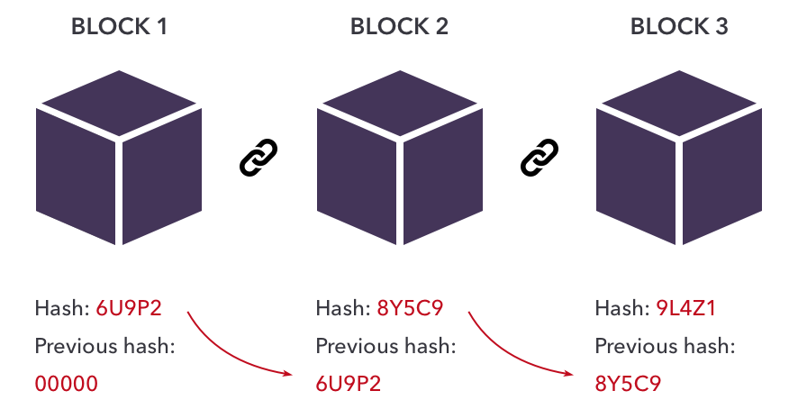
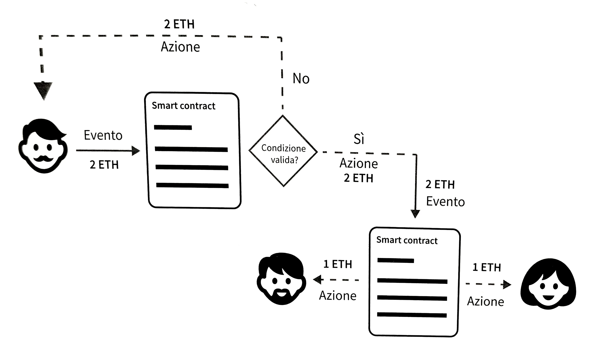
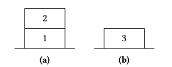

# Tesi

* Table of Content
{:toc}

# Introduzione
Ethereum [1] è una piattaforma blockchain che consente la creazione di un ambiente globale decentralizzato, in cui gli utenti possono sviluppare strumenti digitali sicuri utilizzando la valuta nativa Ether (ETH) per transazioni e servizi computazionali.

La rete Ethereum è costituita da nodi interconnessi che seguono regole definite nel protocollo Ethereum, supportando una vasta gamma di comunità, applicazioni, organizzazioni e attività digitali accessibili a chiunque abbia una connessione internet.

La caratteristica principale di Ethereum è la capacità di eseguire smart contract tramite la Ethereum Virtual Machine (EVM) [2], consentendo funzionalità avanzate al di là delle transazioni finanziarie di base (e.g. Bitcoin [3]). Gli smart contract sono programmi immutabili memorizzati sulla blockchain che eseguono azioni predefinite senza intervento umano.

Tuttavia, garantire la sicurezza e l'affidabilità degli smart contract è essenziale, poiché non possono essere modificati una volta deployati. La presenza di bug o vulnerabilità potrebbe causare gravi conseguenze, come perdite di fondi o azioni indesiderate.

Per garantire la qualità degli smart contract, vengono sviluppate tecniche di analisi e verifica del codice. L'analisi statica, ad esempio, identifica potenziali problemi di sicurezza senza eseguire effettivamente il codice. Tuttavia, nel contesto di Ethereum, la costruzione di un control flow graph (CFG) affidabile è complessa a causa delle destinazioni dinamiche dei salti (Jump Orfane) durante l'esecuzione del EVM bytecode.

In questo elaborato viene presentato EVMLiSA [4], un software in grado di costruire un CFG sound e affidabile (TODO si spera) di smart contract eseguibili su EVM.

TODO scrivere in breve di cosa tratteranno i capitoli

---

# Background
TODO

---

## Che cos'è la Blockchain
Il concetto di blockchain è stato introdotto per la prima volta nel 2008 da Satoshi Nakamoto con il whitepaper di Bitcoin [3] e successivamente implementato nel 2009 come tecnologia alla base di Bitcoin.

È importante sottolineare che Bitcoin e blockchain sono due entità separate: Bitcoin rappresenta solo una delle molteplici applicazioni costruite sulla tecnologia blockchain.

La blockchain è un registro digitale, decentralizzato e distribuito su una rete, strutturato come una catena di blocchi responsabili dell'archiviazione dei dati. Questi dati possono comprendere informazioni di valore economico o intere applicazioni digitali. È possibile aggiungere nuovi blocchi di informazioni, ma non è possibile modificare o rimuovere i blocchi precedentemente aggiunti alla catena.

In questo ambiente, la crittografia e i protocolli di consenso garantiscono sicurezza e immutabilità. Il risultato è un sistema aperto, neutrale, affidabile e sicuro, dove la nostra capacità di utilizzare e fidarci del sistema non dipende dalle intenzioni di nessun individuo o istituzione.

La blockchain può essere considerata parte della famiglia delle Distributed Ledger Technology (DLT): tutti i partecipanti alla rete hanno accesso al registro distribuito e al suo registro immutabile delle transazioni. Questo registro condiviso consente di registrare le transazioni una sola volta, eliminando la duplicazione degli sforzi tipica delle reti aziendali tradizionali. [5]

### Funzionamento
La blockchain è composta da una serie di blocchi, aggiunti uno dopo l'altro in modo sequenziale. Ogni blocco contiene una prova matematica, resa possibile dall'utilizzo della crittografia, che ne assicura la sequenzialità tramite un hash del blocco precedente.

Sebbene il concetto di catena di blocchi sia comune a quasi tutti i sistemi blockchain, la struttura e il contenuto dei blocchi possono variare a seconda dello scopo della blockchain stessa. Ad esempio, i blocchi della blockchain di Bitcoin possono essere diversi da quelli della blockchain di Ethereum.

I blocchi sono interconnessi tramite funzioni di hash crittografiche (e.g. SHA-256 [TODO forse andrebbe spiegato?]), creando un legame matematico tra di loro. Questo processo fornisce un modo conveniente per esprimere l'intero contenuto della blockchain in una singola stringa di lunghezza definita.

Ogni blocco contiene informazioni specifiche (e.g. le transazioni) e l'hash del blocco precedente (Fig. 1). Modificare qualsiasi informazione in un blocco altererebbe l'hash del blocco e, di conseguenza, tutti gli hash successivi, rendendo immediatamente evidente l'alterazione.

Ogni nuovo blocco rafforza la verifica dei blocchi precedenti, rendendo la blockchain a prova di manomissione e fornendo un registro affidabile delle transazioni su cui gli utenti possono fare affidamento. [5]

<figure>
    
    <figcaption align="center">Fig. 1: Funzionamento della blockchain. [6]</figcaption>
</figure>

### Consenso
Il consenso è il processo mediante il quale i nodi della rete raggiungono un accordo su ciò che è avvenuto all'interno della blockchain. Questo accordo rappresenta l'unica verità sullo stato attuale della blockchain e viene ottenuto attraverso un accordo generale tra i partecipanti della rete. Il consenso non è un evento istantaneo, ma un processo continuo che coinvolge vari partecipanti con ruoli e responsabilità specifici. Si basa su principi matematici ed economici per incentivare tutti i membri a raggiungere un accordo su un unico dato. [5]

Nella pratica, il consenso richiede che i nuovi blocchi siano approvati dalla maggioranza dei nodi della rete, che sono distribuiti su una vasta rete di computer. Questo processo può avvenire attraverso due meccanismi principali: la Proof of Work (PoW) e la Proof of Stake (PoS). 

- Proof of Work (PoW): È il sistema di consenso utilizzato principalmente da Bitcoin. Qui, i nodi della rete, noti come "miner", competono per risolvere complessi problemi crittografici. Il primo nodo che risolve con successo il problema crittografico viene premiato con una quantità specifica di criptovaluta. La difficoltà di generare l'hash viene modificata man mano che la rete si espande, in modo che i nuovi blocchi vengano creati e approvati a un ritmo costante al variare della potenza di calcolo della rete. La difficoltà di generare blocchi nella blockchain di Bitcoin, ad esempio, viene regolata modificando il numero di zeri con cui devono iniziare, garantendo che un nuovo hash venga trovato solo una volta ogni dieci minuti circa dall'intera rete. Questi problemi sono progettati per richiedere una grande quantità di potenza di calcolo e l'energia utilizzata in questo processo è sia una caratteristica distintiva che un punto di vulnerabilità di PoW. Se da un lato rende la blockchain sicura, poiché sarebbe estremamente costoso e poco pratico per un singolo attaccante possedere la maggior parte della potenza di calcolo della rete, dall'altro richiede una notevole quantità di energia elettrica. [7]

- Proof of Stake (PoS): È un meccanismo di consenso in cui i nodi della rete, chiamati "validatori", competono per essere selezionati per convalidare il prossimo blocco. La probabilità di essere selezionati è proporzionale alla quantità di criptovaluta che il nodo ha depositato nella blockchain. Quando un validatore viene selezionato, "mette in gioco" (stake) i propri fondi (token). Se il validatore non adempie ai propri doveri o tenta di commettere una frode, rischia di perdere i suoi fondi. PoS non richiede una quantità significativa di energia elettrica come PoW, ma presenta un problema di monopolio della ricchezza, poiché coloro che possiedono più token hanno maggiori probabilità di essere selezionati per convalidare il blocco successivo e ricevere la ricompensa. Questo problema è mitigato con l'introduzione di Delegated Proof of Stake (DPoS), che prevede un sistema di voto per la selezione dei validatori, rendendo il processo più democratico. [7]

### Modelli di blockchain
Le blockchain possono essere categorizzate in vari tipi in base alla loro accessibilità e ai requisiti di utilizzo:
- Permissionless: Questo tipo di blockchain permette a chiunque di accedervi senza restrizioni, senza la necessità di identificarsi. Esempi notevoli sono Bitcoin ed Ethereum. Tuttavia, questa libertà può portare a problemi di dimensionamento e sicurezza, poiché ogni nodo della rete deve elaborare e convalidare l'intera blockchain, rendendo anche più probabile l'ingresso di attori malevoli. [8]

- Permissioned: Al contrario, nelle blockchain ad accesso limitato, l'accesso è controllato e richiede l'autenticazione da parte di un'autorità centrale. Questo approccio riduce i problemi di dimensionamento e sicurezza riscontrati nelle blockchain aperte. Tuttavia, l'intervento di un'autorità centrale compromette parzialmente il principio di decentralizzazione. [8]

Ulteriormente, le blockchain possono essere suddivise in base alle loro applicazioni e requisiti specifici:
- Public: Le blockchain pubbliche incoraggiano la partecipazione di tutti gli utenti, offrendo incentivi come ricompense in criptovaluta. Sono trasparenti e flessibili. Esempi ben noti includono Bitcoin ed Ethereum. [9]

- Private: Le blockchain private sono utilizzate all'interno di reti aziendali o organizzative, spesso per migliorare l'efficienza dei processi interni. Sono meno trasparenti rispetto alle blockchain pubbliche e richiedono solitamente un'autorizzazione per accedervi. [9]

- Consortium: Queste blockchain sono progettate per la collaborazione tra più entità, come aziende o istituzioni. La gestione dell'accesso è condivisa tra i partecipanti, garantendo un certo livello di decentralizzazione senza dipendenza da un'autorità centrale. [9]

### Chiave pubblica e chiave privata
TODO non so se metterlo o no

---

## Ethereum
Ethereum è una blockchain aperta (permissionless), accessibile a chiunque (pubblica) e con il codice sorgente disponibile liberamente (open-source). È stata ideata per la prima volta da Vitalik Buterin nel 2013 [10], con l'obiettivo di creare una blockchain in grado di eseguire una vasta gamma di programmi generici.

Dal punto di vista tecnico, Ethereum può essere considerato una sorta di enorme macchina virtuale globale e "infinita", che opera seguendo uno stato singolo accessibile da qualsiasi parte del mondo e una macchina virtuale che applica le modifiche a tale stato.

Tuttavia, in termini più pratici, Ethereum si presenta come un'infrastruttura informatica decentralizzata, aperta a tutti e basata su codice sorgente accessibile (https://github.com/ethereum/go-ethereum TODO footnote), che consente l'esecuzione di programmi denominati [Smart Contracts](#smart-contracts). Utilizza una blockchain per tenere traccia e registrare le variazioni di stato del sistema, utilizzando la criptovaluta nativa (chiamata Ether) per misurare e regolare i costi delle risorse di elaborazione.

Attraverso la piattaforma Ethereum, gli sviluppatori hanno la possibilità di creare applicazioni decentralizzate con funzioni economiche integrate, offrendo non solo elevata disponibilità, verificabilità, trasparenza e neutralità, ma anche la riduzione o l'eliminazione della censura e alcuni rischi associati alle controparti tradizionali. [2]

### Ethereum vs Bitcoin
Ethereum presenta numerose caratteristiche comuni con altre blockchain aperte: una rete peer-to-peer che collega gli utenti, un algoritmo di consenso per mantenere gli aggiornamenti di stato sincronizzati (inizialmente basato su un consenso proof-of-work, ma con l'avvento dell'aggiornamento "The Merge" [https://ethereum.org/it/roadmap/merge/ TODO footnote], il consenso è passato a proof-of-stake), l'uso di tecniche crittografiche come firme digitali e hash, e una valuta digitale denominata *ether* (ETH).

Tuttavia, sia lo scopo che la struttura di Ethereum si differenziano notevolmente da quelle delle blockchain precedenti, come Bitcoin.

Il principale obiettivo di Ethereum non è solo quello di fungere da sistema di pagamento digitale. Anche se l'*ether* è fondamentale per il funzionamento di Ethereum, essa viene considerata una "valuta di utilità" utilizzata per pagare l'utilizzo della piattaforma Ethereum come un computer globale.

A differenza di Bitcoin, che dispone di un linguaggio di scripting limitato, Ethereum è stato progettato per essere una blockchain programmabile per scopi generici, con una macchina virtuale [EVM](#ethereum-virtual-machine) in grado di eseguire codice di complessità arbitraria e illimitata. Mentre il linguaggio di scripting di Bitcoin si limita principalmente a valutazioni semplici (true/false) delle condizioni di spesa di un utente, il linguaggio di Ethereum (Solidity [11]) è quasi completo in termini di capacità computazionale (*Turing completeness*), consentendo ad Ethereum di funzionare come un computer per scopi generali. [2]

### Funzionamento
Sulla blockchain Ethereum sistono due tipi principali di account utilizzabili per gestire le transazioni e l'interazione sulla rete: gli Externally Owned Account e i Contract Account.

Gli Externally Owned Account (EOA) sono controllati direttamente dagli utenti e sono associati a una coppia di chiavi crittografiche, pubblica e privata. Questi account consentono agli individui di ricevere e inviare *ether* e di partecipare alle transazioni sulla rete. Le transazioni tra due account esterni coinvolgono esclusivamente lo scambio di *ether* e non comportano alcun costo di creazione dell'account. [12]

I Contract Account, invece, sono associati agli smart contract. Questi account contengono il codice dello smart contract e vengono attivati quando ricevono una transazione. Le transazioni con questi account possono coinvolgere l'esecuzione di codice dello smart contract, oltre allo scambio di *ether* e comportano un costo di creazione in quanto richiedono risorse di calcolo e di archiviazione sulla rete Ethereum. [12]

Affinché una transazione venga effettuata su Ethereum, il mittente deve conoscere l'indirizzo del destinatario, detto anche *chiave pubblica dell'account*, e firmare digitalmente la transazione con la propria chiave privata. Questo processo dimostra che il richiedente della transazione è il legittimo proprietario dell'account. 

Le transazioni sono essenzialmente istruzioni crittograficamente firmate da un account che iniziano una modifica dello stato della rete Ethereum. Inoltre, per "transazione" si intende una transazione approvata e inclusa in un blocco della blockchain.

Poiché le transazioni sono atomiche, esse devono essere eseguite completamente prima di apportare cambiamenti allo stato globale della rete. Questo significa che tutte le istruzioni all'interno della transazione devono essere valide. Se una qualsiasi istruzione fallisce, gli effetti della transazione vengono annullati e lo stato viene ripristinato al momento precedente (rollback), come se la transazione non fosse mai avvenuta. Anche se una transazione fallisce, viene comunque registrata come tentata, ma non influenza lo stato complessivo della rete. [13]

Ogni transazione su Ethereum comporta un costo proporzionale alla sua complessità computazionale, misurato in "gas". Possiamo pensare al gas come al carburante necessario per far funzionare le operazioni sulla blockchain, simile al carburante utilizzato da un'auto per percorrere una determinata distanza.

Ogni operazione sulla blockchain ha un costo specifico in gas. Ad esempio, eseguire un hash o fare una somma di due numeri richiede una differente quantità di gas (30 e 3, rispettivamente). Il gas è misurato in "wei" ($1 \text{ wei } = 1^{-18} \text{ ETH}$) ed è strettamente legato alle transazioni. Ogni transazione su Ethereum ha due parametri: il prezzo del gas (gas price) e il limite del gas (gas limit), che rappresentano rispettivamente il prezzo che si è disposti a pagare per unità di gas e la quantità massima di gas utilizzabile.

A differenza di Bitcoin, dove esiste un limite alla dimensione massima di un blocco, su Ethereum si fa riferimento al limite di gas, che determina la massima quantità di calcoli che la Ethereum Virtual Machine deve eseguire per blocco.

Immaginiamo di dover eseguire una transazione che richiede 10 gas e abbiamo deciso di pagare 100 wei per ogni gas: il costo totale della transazione sarà di 1000 wei (`10 * 100`). Se aumentiamo il prezzo del gas a 1000 wei per gas, il costo totale della transazione sarà di 10000 wei (`10 * 1000`). I validatori della rete Ethereum sono liberi di scegliere le transazioni da includere nel nuovo blocco, e generalmente cercano di massimizzare il profitto. Di conseguenza, le transazioni con un prezzo del gas più elevato hanno una priorità maggiore di essere aggiunte al blocco successivo.

Se una transazione richiede 15 gas ma abbiamo impostato un limite di 10 gas, l'esecuzione si interromperà quando verrà raggiunto il limite, e tutto il gas andrà perso. Se, invece, il limite di gas è superiore a quello utilizzato dalla transazione, il gas in eccesso verrà restituito al mittente.

Quindi, il costo totale di una transazione può essere calcolato con la seguente formula:
$\text{Costo transazione } = \text{ Limite di gas } \times \text{ Prezzo del gas}$

Oltre a compensare i validatori, il costo delle transazioni su Ethereum serve anche a proteggere la blockchain da attacchi, come il DDoS, e da errori di programmazione negli smart contract che potrebbero sovraccaricare il sistema. Ad esempio, se una computazione finisse in un ciclo infinito, la gestione del gas interromperebbe l'esecuzione una volta che il gas disponibile è esaurito. Questa caratteristica ci consente di definire Ethereum come un linguaggio (quasi) Turing-completo, poiché siamo sicuri che ogni programma in esecuzione terminerà. [5]

## Smart Contracts
Il concetto di smart contract è stato introdotto per la prima volta da Nick Szabo nel 1994, definendolo come "un protocollo di transazione digitale che esegue i termini di un contratto" [15]. Lo scopo principale di uno smart contract è quello di automatizzare l'adempimento delle condizioni contrattuali, riducendo al minimo il rischio di azioni malevole e la necessità di fidarsi degli intermediari (rischio di controparte).

Un contratto, in generale, è un accordo legalmente vincolante tra due o più parti e svolge un ruolo fondamentale nell'instaurare fiducia tra i soggetti coinvolti in una transazione. Può essere tanto semplice quanto un biglietto dell'autobus o molto complesso come un contratto di lavoro. [16]

Nel contesto delle blockchain, uno smart contract è un programma che replica tutte le caratteristiche di un contratto tradizionale, ma viene memorizzato ed eseguito all'interno di una blockchain. Si tratta di un agente autonomo che risiede su una blockchain, senza la necessità di un'entità esterna per valutare le condizioni e prendere decisioni. Questo ruolo è sostituito dal consenso della rete. Gli smart contract stabiliscono le regole e le fanno rispettare automaticamente alle parti coinvolte, senza la necessità di autorità centrali. Quando le condizioni del contratto vengono soddisfatte, lo smart contract esegue autonomamente azioni specifiche, come ad esempio il trasferimento di denaro [5].

Un smart contract può essere paragonato a un'applicazione IFTTT (If This Then That) che risponde a eventi specifici (Figura 2).

<figure>
    
    <figcaption align="center">Fig. 2: Il processo IFTTT (If This Then That) negli smart contract. [5]</figcaption>
    <figcaption align="center">TODO sistemare con photoshop questa figura</figcaption>
</figure>

Gli smart contract, solitamente redatti in un linguaggio di alto livello come Solidity, necessitano di essere compilati nel bytecode di basso livello eseguito nell'EVM per poter essere eseguiti. Dopo la compilazione, vengono distribuiti sulla piattaforma Ethereum attraverso una speciale transazione di creazione del contratto, inviata all'indirizzo di creazione del contratto `0x0`, detto *zero address*. Ogni contratto è identificato da un indirizzo Ethereum, derivato dalla transazione di creazione del contratto in funzione dell'account di origine e del nonce. Come già menzionato nella sezione [Funzionamento](#funzionamento), a differenza degli EOAs, gli account creati per nuovi smart contract non hanno chiavi associate.

Gli smart contract vengono eseguiti solo quando vengono richiamati da una transazione. Ogni smart contract in Ethereum viene eseguito a seguito di una transazione avviata da un EOA. Un contratto può richiamare un altro contratto, che a sua volta può richiamare un altro contratto e così via, ma il primo contratto in questa catena di esecuzione sarà sempre stato richiamato da una transazione proveniente da un EOA.

Le transazioni sono atomiche, indipendentemente dal numero di smart contract richiamati o dalle azioni che eseguono. Ogni transazione viene eseguita nella sua totalità e le eventuali modifiche allo stato globale vengono registrate solo se l'esecuzione termina con successo. Se l'esecuzione fallisce a causa di un errore, tutti gli effetti vengono annullati e la transazione viene registrata come tentata.

È importante notare che una volta distribuito, il codice di un contratto non può essere modificato. Approfondiremo ulteriormente questo aspetto in seguito.

### Esempio
Ma adesso vediamo un esempio di smart contract (tratto da Solidity by Example [17]):

```solidity
// SPDX-License-Identifier: MIT
pragma solidity ^0.8.24;

contract ReceiveEther {
    // Function to receive Ether. msg.data must be empty
    receive() external payable {}

    // Fallback function is called when msg.data is not empty
    fallback() external payable {}

    function getBalance() public view returns (uint256) {
        return address(this).balance;
    }
}

contract SendEther {
    function sendViaCall(address payable _to) public payable {
        // Call returns a boolean value indicating success or failure.
        (bool sent, bytes memory data) = _to.call{value: msg.value}("");
        require(sent, "Failed to send Ether");
    }
}
```

Questo smart contract è composto da due contratti: *ReceiveEther* e *SendEther*.

Il contratto *ReceiveEther* è progettato per ricevere *ether*. Contiene due funzioni: `receive` e `fallback`. La funzione `receive` viene chiamata quando viene inviato *ether* al contratto e non ci sono dati associati alla transazione. Questo è possibile tramite l'invio di *ether* direttamente all'indirizzo del contratto senza specificare alcuna funzione. La funzione `fallback` viene invece chiamata quando viene inviato *ether* al contratto e sono presenti dati associati alla transazione. Entrambe le funzioni accettano *ether* e sono contrassegnate come payable per indicare che possono ricevere fondi. È importante specificare che un contratto che riceve *ether* deve avere almeno una di queste due funzioni.

La funzione `getBalance` restituisce il saldo attuale del contratto in *ether*.

Il contratto *SendEther* è progettato invece per inviare *ether*. Contiene una funzione `sendViaCall` che invia *ether* a un altro indirizzo Ethereum. Questa funzione prende in input l'indirizzo del destinatario e l'ammontare di *ether* da inviare. Utilizza la funzione `call` per inviare *ether* al destinatario e restituisce un booleano che indica se l'operazione è stata eseguita con successo. Infine, la funzione `require` permette di verificare che l’invio sia andato a buon fine, in caso contrario l’esecuzione viene interrotta con un messaggio di errore.

## Ethereum Virtual Machine
Al cuore del protocollo e del funzionamento di Ethereum risiede l'Ethereum Virtual Machine (EVM). Questa componente software gestisce l'implementazione e l'esecuzione degli smart contracts. Quasi ogni azione sulla rete Ethereum comporta un aggiornamento dello stato calcolato dall'EVM, ad eccezione delle semplici transazioni di trasferimento di valore da un EOA ad un altro. A un livello più alto, possiamo concepire l'EVM come un enorme computer decentralizzato, distribuito su scala globale, che contiene milioni di "programmi" eseguibili, ognuno dei quali con il proprio spazio dati permanente. [2]

A livello matematico, possiamo definire l'EVM come una funzione matematica: dato un input, essa produce un output deterministico. In particolare, la funzione di transizione è definita come segue: $Y(S,T) = S'$, dove $S$ è il vecchio stato macchina valido e $T$ è un insieme di transazioni valide che, se applicate allo stato $S$, producono lo stato $S'$. [14]

Come detto in precedenza, l'EVM è una macchina quasi Turing-completa, il che significa che tutti i processi di esecuzione sono limitati a un numero finito di passaggi computazionali, determinati dalla quantità di gas disponibile per ogni esecuzione di uno smart contract. Questo limite assicura che ogni programma abbia una fine definita, evitando situazioni in cui l'esecuzione potrebbe protrarsi all'infinito, portando alla congestione dell'intera piattaforma Ethereum. [2]

Dal punto di vista architetturale, l'EVM utilizza uno stack, ovvero una coda volatile di tipo LIFO (Last In First Out), per memorizzare tutti i valori in memoria, con una profondità massima di 1024 elementi. Opera su parole (words) di 256 bit, principalmente per agevolare le operazioni di hashing, e include diverse componenti di dati indirizzabili:
1. una ROM virtuale contenente il codice del programma, immutabile una volta caricato il bytecode dello smart contract da eseguire;
2. una memoria volatile (Memory), in cui ogni posizione è inizializzata a zero e può essere utilizzata temporaneamente durante l'esecuzione;
3. uno spazio di archiviazione permanente (Storage), parte dello stato di Ethereum, anch'esso inizializzato a zero, che conserva informazioni a lungo termine.

<figure>
    
    <figcaption align="center">Fig. 3: Componenti della Ethereum Virtual Machine.</figcaption>
</figure>

Il ruolo principale dell'EVM consiste nell'aggiornare lo stato di Ethereum attraverso il calcolo di transizioni di stato valide derivanti dall'esecuzione del codice degli smart contracts. Questo concetto rende Ethereum una macchina a stati basata sulle transazioni, poiché gli attori esterni, come gli utenti della rete, iniziano le transizioni di stato creando, accettando e ordinando le transazioni. 

Per comprendere meglio cosa costituisca lo stato di Ethereum, possiamo suddividerlo in due livelli. Al livello superiore troviamo lo stato globale di Ethereum, che è essenzialmente una mappatura degli indirizzi Ethereum (160 bit) agli account della rete. [2]

Scendendo al livello inferiore, ogni indirizzo Ethereum rappresenta un account, che include diverse informazioni:
- il saldo in ether, espresso come il numero di wei posseduti dall'account;
- il nonce, che tiene traccia del numero di transazioni inviate con successo da quell'account, se si tratta di un account controllato dall'utente (EOA), o il numero di smart contract creati, se è un contract account;
- lo storage dell'account, che funge da archivio dati permanente utilizzato esclusivamente dagli smart contracts;
- il codice del programma dell'account, presente solo se l'account è uno smart contract. Da notare che un account esterno controllato dall'utente avrà sempre codice nullo e uno storage vuoto.

Quando una transazione coinvolge l'esecuzione del codice di uno smart contract, viene creata un'istanza dell'EVM (Ethereum Virtual Machine) con tutte le informazioni necessarie relative al blocco corrente in fase di creazione e alla transazione specifica in elaborazione. In questo processo, il codice dello smart contract viene caricato nell'EVM, il program counter viene impostato a zero, lo storage del contract account viene recuperato, la memoria viene inizializzata e le variabili di blocco e di ambiente vengono configurate. [2]

Un aspetto fondamentale è la quantità di gas disponibile per questa esecuzione, determinata dalla quantità di gas pagata dal mittente all'inizio della transazione. Durante l'esecuzione del codice, la quantità di gas disponibile diminuisce in base al costo delle operazioni eseguite. Se il gas disponibile si esaurisce, viene lanciata un'eccezione "Out of Gas (OOG)" e l'esecuzione viene interrotta, annullando la transazione. Nessuna modifica viene apportata allo stato di Ethereum, tranne l'incremento del nonce del mittente e il pagamento delle commissioni al validatore.

Possiamo immaginare l'EVM che opera su una copia isolata dello stato effettivo di Ethereum, scartando completamente questa versione isolata se l'esecuzione non può essere completata. Tuttavia, se l'esecuzione ha successo, lo stato effettivo viene aggiornato per corrispondere alla versione isolata, inclusi eventuali cambiamenti nei dati di archiviazione del contratto chiamato, la creazione di nuovi smart contracts e i trasferimenti di *ether* avviati. [2]

## EVM bytecode
Come accennato in precedenza, Ethereum esegue gli smart contract all'interno dell'Ethereum Virtual Machine (EVM), un ambiente di runtime decentralizzato che si occupa dell'esecuzione del codice di tali contratti. Gli sviluppatori possono scrivere gli smart contract utilizzando diversi linguaggi di alto livello, come Solidity [11] o Vyper [18], ma affinché possano essere eseguiti dall'EVM, devono essere compilati in un linguaggio di basso livello noto come EVM bytecode. Il bytecode dell'EVM è un linguaggio a basso livello basato su stack che comprende circa 150 istruzioni chiamate *opcodes* (la lista la possiamo trovare a https://ethereum.github.io/yellowpaper/paper.pdf TODO footnote), le quali vengono interpretate dall'EVM per manipolare uno stack i cui elementi sono parole di 256 bit. Ogni istruzione è rappresentata da un numero esadecimale preceduto da `0x`.

Consideriamo questo breve frammento di bytecode dell'EVM:

```
60 01 60 02 01
```

Il byte `60` corrisponde all'opcode `PUSH1`, il quale inserisce un byte nello stack. Il byte successivo è `01`, che corrisponde al valore che e' stato messo in cima allo stack. Allo stesso modo, i byte `60 02` rappresentano l'istruzione EVM `PUSH1 0x02` (lo stack dopo l'esecuzione di questi opcode è mostrato in Fig. 4a). L'ultimo byte, ossia `01`, corrisponde all'opcode `ADD`, il quale preleva due elementi dallo stack, li somma e mette il risultato di nuovo sulla pila. Pertanto, la versione tradotta in linguaggio umano della stringa di bytecode appena analizzata è:

```
PUSH1 0x01
PUSH1 0x02
ADD
```

Dopo l'esecuzione di queste istruzioni, l'elemento in cima allo stack avrà il valore 3 (lo stack dopo l'operazione ADD è mostrato in Fig. 4b).

<figure>
    
    <figcaption align="center">Fig. 4: Stato dello stack (a) prima e (b) dopo l'esecuzione dell'opcode ADD.</figcaption>
</figure>

## Alterazione flusso di esecuzione
### Jump e JumpI (funzionamento)
### Pushed Jumps vs Orphan Jumps
#### Esempi
## Vulnerabilità di rientranza
### Storia attacco The DAO

# Analisi statica
## Interpretazione astratta
## Perchè ci viene in aiuto

# EVMLiSA
## LiSA
## Come sono fatti i CFG

# Dominio: AbstractStack
## Stati interni (KIntegerSet, Memory, mu_i)
## Algoritmo per la costruzione del CFG
### Funzionamento con esempi
## Metodi principali
### SmallStepSemantics
### LUB
### Less or Equal
### Widening
### Assume
## Limiti di approssimazione

# Da AbstractStack ad AbstractStackSet
## Problemi risolti rispetto ad AbstractStack
## Benefici portati
## Nuovo algoritmo per la costruzione del CFG
## Nuovi metodi principali
### SmallStepSemantics
### LUB
### Less or Equal
### Widening
### Assume

# Checker semantico
## Funzionamento di JumpChecker
## Spiegazione jumps (Sound, Precisely, Unreachable, ecc.)

# Valutazione sperimentale
## Benchmark vs risultati vecchio dominio (SymbolicStack di Davide)
## Benchmark vs EtherSolve
## Benchmark su 5000 smart contracts
## Considerazioni finali
## Lavori correlati

# Conclusione

# References
1. Ethereum: https://cryptodeep.ru/doc/paper.pdf
2. Mastering Ethereum: https://books.google.it/books?id=SedSMQAACAAJ
3. Bitcoin: https://bitcoin.org/bitcoin.pdf
4. EVMLiSA: https://github.com/lisa-analyzer/evm-lisa
5. Blockchain. Tecnologia e Applicazioni per il business: https://www.hoeplieditore.it/hoepli-catalogo/articolo/blockchain-gianluca-chiap/9788820389253/1522
6. IG: https://www.ig.com/ae/trading-strategies/what-is-blockchain-technology--200710
7. Tesi di Davide Tarpini
8. Permission.io: https://www.permission.io/blog/permissioned-vs-permissionless-blockchains-explained
9. Blockchain Council: https://www.blockchain-council.org/blockchain/types-of-blockchains-explained-public-vs-private-vs-consortium/
10. Ethereum Whitepaper: https://ethereum.org/it/whitepaper/
11. Solidity: https://docs.soliditylang.org/en/latest/
12. Ethereum Account Type: https://ethereum.org/en/developers/docs/accounts/
13. Ethereum Smart Contract: https://ethereum.org/en/developers/docs/smart-contracts/
14. Ethereum Virtual Machine: https://ethereum.org/en/developers/docs/evm/
15. Nick Szabo: introduzione agli smart contracts 1994: https://www.fon.hum.uva.nl/rob/Courses/InformationInSpeech/CDROM/Literature/LOTwinterschool2006/szabo.best.vwh.net/smart.contracts.html
16. Treccani: definizione contratto: https://www.treccani.it/enciclopedia/contratto/
17. Smart contract di esempio: https://solidity-by-example.org/sending-ether/
18. Vyper: https://docs.vyperlang.org/en/stable/toctree.html